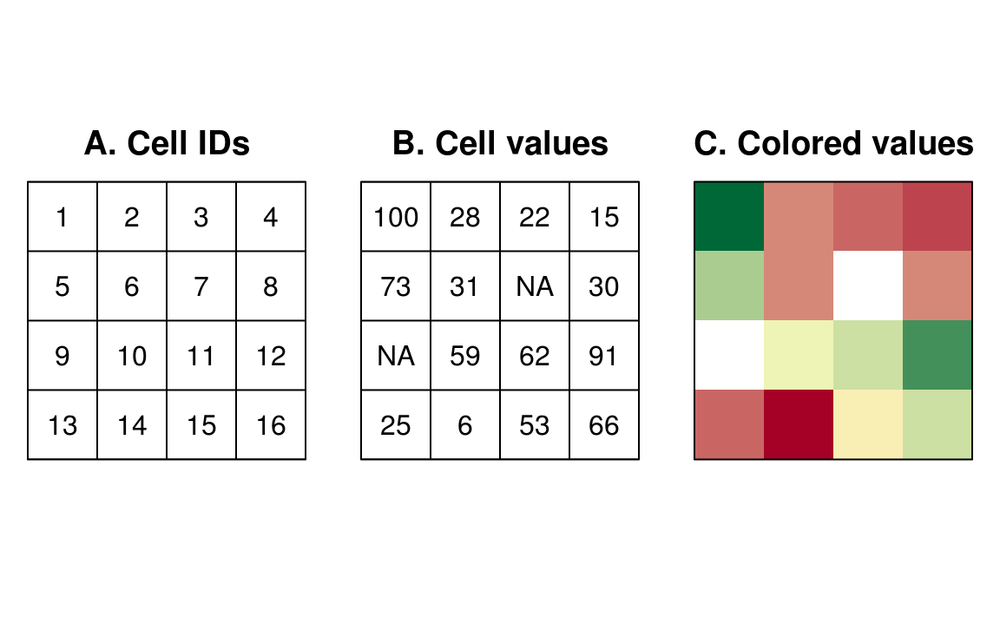

# Overview

#### Data manipulation

* Vector data: [sf](https://r-spatial.github.io/sf/)
* Raster data: [raster](https://github.com/rspatial/raster)

#### Visualization

* Thematic maps: [tmap](https://github.com/mtennekes/tmap)
* Raster data: [rasterVis](https://oscarperpinan.github.io/rastervis/)
* Interactive maps: [tmap](https://github.com/mtennekes/tmap) & [mapview](https://r-spatial.github.io/mapview/)

#### Resources

* [Lovelace et al. (2019): Geocomputation with R](https://geocompr.robinlovelace.net/index.html)
* [Pebesma & Bivand (forthcoming): Spatial Data Science](https://keen-swartz-3146c4.netlify.com)
* [Bivand et al. (2013): Applied Spatial Data Analysis with R](https://www.springer.com/gp/book/9781461476177)
* [RSpatial.org](https://rspatial.org)
* [r-spatial.org](https://www.r-spatial.org)
* [CRAN Task View: Analysis of Spatial Data](https://cran.r-project.org/web/views/Spatial.html)
* [r-sig-geo mailing list](https://stat.ethz.ch/mailman/listinfo/R-SIG-Geo/)

---

# Why use R for geospatial data?

* Automation + reproducibility (vs. ArcGIS, QGIS, etc.)

* Ease of use (vs. C++/Java)

* Rich ecosystem of tools for statistical analysis (spatial + not), predictive modeling, and visualisation (vs. Python)

---

# Geospatial data models

.pull-left[
### Vector

]

.pull-right[
### Raster

]

.footnote[*Img: Lovelace et al. 2019*<sub>]

---

# sf package

"Simple features" = OGC standard for representation of vector spatial data, used by many spatial libraries (GDAL, GEOS), databases (PostGIS), etc.

Extends `data.frame` or `tibble` by adding a geometry column. This makes it easy to work with sf object as you would any other data.frame (pipe-based workflows, dplyr, etc.)

Provides consistent interface to [gdal](https://gdal.org) and [geos](https://trac.osgeo.org/geos) libraries.

Largely supersedes [sp](https://cran.r-project.org/web/packages/sp/index.html), `rgdal`, and `rgeos` packages (although some other packages have not yet been updated to work with sf).

---

# sf setup

#### Prerequisites

```{r eval=FALSE}
install.packages("sf")
install.packages("spData")    # for demo datasets
install.packages("tidyverse") # to demonstrate tidyverse compatibility
```

*Note:* the R spatial ecosystem depends on three open-source C/C++ libraries:

* [gdal](https://gdal.org): translator for geospatial data formats
* [geos](https://trac.osgeo.org/geos): spatial geometry engine
* [proj](https://proj.org): coordinate reference system transformations

These are included with the *binary* release of [sf](https://r-spatial.github.io/sf/) for Windows and Mac. If you use Unix or install packages from source you will need to install these separately.

---

# sf example

```{r}
library(sf)
library(spData)    # demo datasets
library(tidyverse) # show compatibility with tidyverse

class(world)
names(world)
```

---

# sf geometry column is sticky

```{r}
# Sticky geometry column
world[1:3, 2]

# Get a single column
world$iso_a2 %>% head
```

---

# sf pipe-based workflow

```{r fig.height=5}
world %>%
  dplyr::filter(continent == "Africa") %>%
  dplyr::select(pop) %>%
  plot(main = "Population")
```

---

# sf functions

All sf functions start with a `st_` prefix (for "spatial-temporal", taken from PostGIS).

Reading / writing - works with files or databases

```{r eval=FALSE}
st_read()
st_write()
```

Inspection

```{r eval=FALSE}
st_bbox() # bounding box
st_coordinates()
st_crs()
st_geometry() # get the geometry column
```

To / from sp

```{r eval=FALSE}
world_sp <- as(world, "Spatial")
world_sf <- st_as_sf(world_sp)
```

---

# sf to / from data.frame

```{r fig.height=5}
# sf to data.frame
world_df <- st_drop_geometry(world)

# data.frame to sfc
set.seed(1)
pts <- data.frame(lat = runif(5, 30, 80), lon = runif(5, -5, 10)) %>%
       st_as_sf(coords = c("lon", "lat"), crs = 4326) # EPSG:4326 = WGS84

plot(world$geom)
plot(pts, pch = 19, cex = 2, col = "blue", add = T)
```

---

# sf coordinate reference systems

```{r}
# Get CRS
st_crs(world)

# Project using EPSG code
st_transform(world, crs = 3035) %>%
  st_crs()

# Project using proj4string
st_transform(world, crs = "+proj=sinu +lon_0=0 +x_0=0 +y_0=0 +a=6371007.181 +b=6371007.181 +units=m +no_defs") %>%
  st_crs()
```

---

# Simple spatial subsetting

```{r}
world[pts, "iso_a2"]
```

---

# sf quantities and geometric operations

```{r eval=FALSE}
st_area()
st_buffer()
st_contains()
st_difference()
st_intersects()
st_intersection()
st_length()
st_overlaps()
st_touches()
st_union()
...
```

---

### sf and ggplot2

```{r fig.height=5}
library(ggplot2)

ggplot() +
  geom_sf(data = world, aes(fill = iso_a2), show.legend = FALSE) +
  geom_sf(data = pts) +
  coord_sf(crs = "+proj=robin +lon_0=0 +x_0=0 +y_0=0 +datum=WGS84 +units=m +no_defs")
```

---

# raster package

Three types of raster objects

* `RasterLayer` = a single layer (e.g. elevation)
* `RaterStack` = multiple layers with the same spatial extent and CRS (e.g. daily temperature); more flexible than RasterBrick (layers can be mix of in memory and multiple files)
* `RasterBrick` = like a RasterStack but all layers are contained in a single file; faster processing compared to RasterStack

A key feature of the raster package is that it only loads data into memory when needed. If there is insufficient memory and the `filename` argument is provided, raster functions will process data in chunks and write directly to disk rather than loading into memory.

Note: `raster` relies on `sp` and `rgdal`. The new [stars](https://r-spatial.github.io/stars/) package is intended to supersede `raster` and will provide a structure and interface more similar to `sf` and support for multidimensional data cubes (e.g. x, y, z, time).

---

# raster setup

```{r eval=FALSE}
install.packages("sp")     # imported by raster
install.packages("rgdal")  # needed for reading/writing many data formats
install.packages("raster")
```

```{r}
library(raster)
```

Watch out for masking of `dplyr::select` and `tidyr::extract`!

---

# raster example

```{r}
t2m <- raster::brick("data/era5_t2m.tif")
raster::inMemory(t2m)
t2m
```

---

```{r fig.height=5}
names(t2m) <- paste0("t2m_20180601_", 0:23)

# Get one or more layers
t2m[[1:3]] %>%
  plot
```

---

```{r}
# Get values from a single layer
t2m$t2m_20180601_0[1:3, 1:3]

# Cells are indexed from the top left corner along rows then by columns
raster::xyFromCell(t2m, c(1, 55, 56))
```

---

# raster functions

Reading / writing

```{r eval=FALSE}
raster::raster() # create or read a RasterLayer
raster::stack()  # create or read a RasterStack
raster::brick()  # create or read a RasterBrick
raster::writeRaster() # save to disk
```

Inspection

```{r eval=FALSE}
raster::crs()        # get or set CRS
raster::projection() # get or set CRS
raster::coordinates()
raster::extent()     # bounding box
```

---

# Projection

```{r fig.height=5}
# Uses bilinear or nearest neighbour
t2m$t2m_20180601_0 %>%
  projectRaster(crs = "+proj=laea +lat_0=52 +lon_0=10 +x_0=4321000 +y_0=3210000 +ellps=GRS80 +towgs84=0,0,0,0,0,0,0 +units=m +no_defs") %>%
  plot
```

```{r eval=FALSE}
raster::projectRaster()crs()        # get or set CRS
raster::projection() # get or set CRS
raster::coordinates()
raster::extent()     # bounding box
```

---

# raster -> vector

```{r eval=FALSE}
raster::rasterToPoints()   # returns centroids
raster::rasterToPolygons() # returns borders
```

```{r fig.height=5}
plot(rasterToPoints(t2m$t2m_20180601_0))
plot(world$geom, add = T)
```

---

# vector -> raster

```{r fig.height=4}
france <- world[, "iso_a2"] %>%
          dplyr::filter(iso_a2 == "FR") %>%
          st_cast("POLYGON") %>%
          mutate(area = st_area(geom)) %>%
          dplyr::arrange(-area) %>%
          .[1, ]
fr_rst <- raster::rasterize(france, t2m)
plot(fr_rst, axes = FALSE, box = FALSE)
```

---

# raster operations

```{r eval=FALSE}
raster::area()    # area of each cell
raster::crop()    # reduce extent by that of a raster a spatial object
raster::extract() # get values at locations of points or polygons
raster::focal()   # moving window summaries
raster::zonal()   # zonal statistics based on "zones" defined by layers of a raster value
...
```

---

# Map algebra

```{r fig.height=5}
plot(max(t2m) * fr_rst)
```

---

# Mapping

Livecoding: [mapping_demo.R](https://github.com/ihough/talk_2019-10_geospatial_r-in-grenoble/blob/master/mapping_demo.R)
